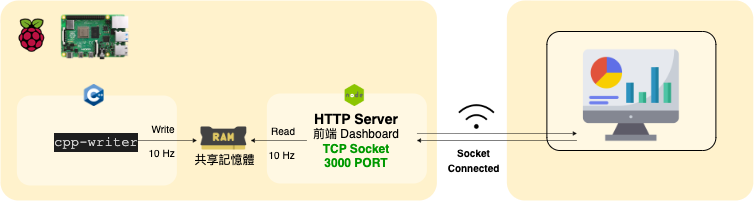

- cpp-writer: 使用C++連續固定時間亂數生成N筆浮點數寫入共享記憶體，此程式碼也有結構化封裝 `shared_memory_writer.h`。
- nodedjs-reader: 使用Node.js固定時間在指定共享區塊讀取N筆浮點數，此外這支程式有結構化`sharedMemory.js`封裝起來。
- nodejs-tcp-socket-reader: 參考 `nodedjs-reader` 並封裝成TCP Socket API，與前端網頁互動。

